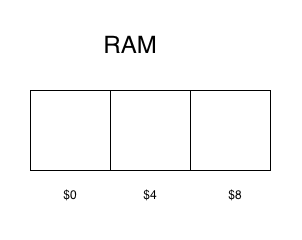

## What is a Data Structure?
A data structure is a way of **organizing and structuring data** so that it can be used efficiently. In the context of computer science, this structuring happens inside the **RAM** (Random Access Memory).

### The Building Blocks of Memory
* **Bit:** The smallest unit of data, representing either a **0** or a **1**.
* **Byte:** A group of **8 bits**.
* **RAM:** Measured in Gigabytes (GB). One GB is roughly $10^9$ bytes.

---

## How Data is Stored in RAM
RAM can be thought of as a continuous block of memory where each piece of data has two main components:
1.  **Value:** The actual data being stored (e.g., an integer or a character).
2.  **Address:** A distinct location in memory, often represented with a hexadecimal value (e.g., `$0`, `$4`, `$8`).

