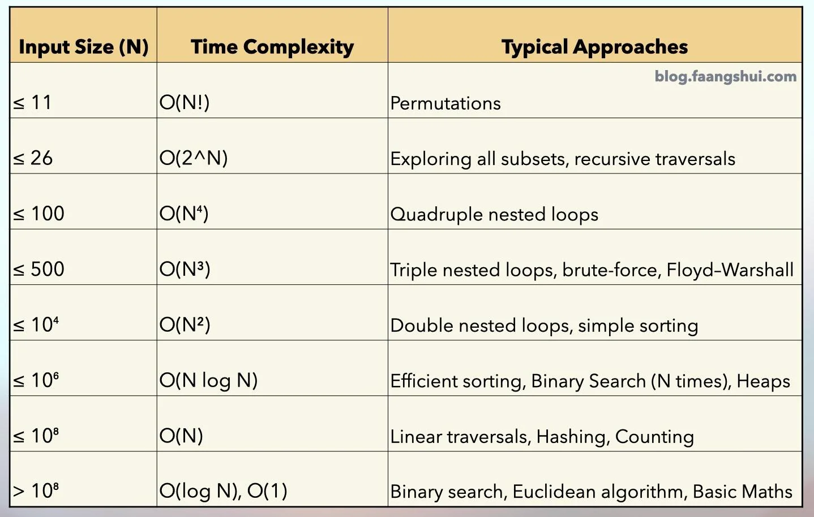

# Intro 

Competitive programming combines two topics: 
- The design of algorithms and
- The implementation of algorithms.

The design of algorithms consists of problem solving and mathematical thinking. Skills for analyzing problems and solving them creatively are needed. An algorithm for solving a problem has to be both correct and efficient, and the core of the problem is often about inventing an efficient algorithm. Theoretical knowledge of algorithms is important to competitive programmers. Typically, a solution to a problem is a combination of well-known techniques and new insights. The techniques that appear in competitive programming also form the basis for the scientific research of algorithms.

The implementation of algorithms requires good programming skills. In competitive programming, the solutions are graded by testing an implemented algorithm using a set of test cases. Thus, it is not enough that the idea of the algorithm is correct, but the implementation also has to be correct. A good coding style in contests is straightforward and concise. Programs should be written quickly, because there is not much time available. Unlike in traditional software engineering, the programs are short (usually at most a few hundred lines of code), and they do not need to be maintained after the contest

# Time complexity

The efficiency of algorithms is important in competitive programming. Usually, it is easy to design an algorithm that solves the problem slowly, but the real challenge is to invent a fast algorithm. If the algorithm is too slow, it will get only partial points or no points at all.

The **time complexity** of an algorithm estimates how much time the algorithm will use for some input. The idea is to represent the efficiency as a function whose parameter is the size of the input. By calculating the time complexity, we can find out whether the algorithm is fast enough without implementing it.

## Calculation rules

### Order of magnitude

A time complexity does not tell us the exact number of times the code inside a loop is executed, but it only shows the order of magnitude. In the following examples, the code inside the loop is executed 3n, n + 5 and ⌈n/2⌉ times, but the time complexity of each code is O(n).

```cpp
for (int i = 1; i <= 3*n; i++) {
    // code
}

for (int i = 1; i <= n+5; i++) {
    // code
}

for (int i = 1; i <= n; i += 2) {
    // code
}
```

### Phases

If the algorithm consists of consecutive phases, the total time complexity is the largest time complexity of a single phase. The reason for this is that the slowest phase is usually the bottleneck of the code. For example, the following code consists of three phases with time complexities O(n), O(n^2) and O(n). Thus, the total time complexity is O(n^2).

```cpp

for (int i = 1; i <= n; i++) {
    // code
}

for (int i = 1; i <= n; i++) {
    for (int j = 1; j <= n; j++) {
        // code
    }
}

for (int i = 1; i <= n; i++) {
    // code
}
```

### Several variables

Sometimes the time complexity depends on several factors. In this case, the time complexity formula contains several variables.

For example, the time complexity of the following code is O(n*m):
```cpp
for (int i = 1; i <= n; i++) {
    for (int j = 1; j <= m; j++) {
        // code
    }
}
```

### Recursion

The time complexity of a recursive function depends on the number of times the function is called and the time complexity of a single call. The total time complexity is the product of these values.

For example, consider the following function:

```cpp
void g(int n) {
    if (n == 1) return;
    g(n-1);
    g(n-1);
}
```

In this case each function call generates two other calls, except for n = 1.

Based on this, the time complexity is

1 + 2+ 4+ · · · + 2^n−1 = 2^n− 1= O(2^n).

Most algorithms in this book are polynomial. Still, there are many important problems for which no polynomial algorithm is known, i.e., nobody knows how to solve them efficiently. **NP-hard** problems are an important set of problems, for which no polynomial algorithm is known.

## Estimating efficiency

By calculating the time complexity of an algorithm, it is possible to check, before implementing the algorithm, that it is efficient enough for the problem. The starting point for estimations is the fact that a modern computer can perform 10^8 operations per second. **This information makes it easier to design the algorithm, because it rules out approaches that would yield an algorithm with a worse time complexity.**



# Data Structures

A data structure is a way to store data in the memory of a computer. It is important to choose an appropriate data structure for a problem, because each data structure has its own advantages and disadvantages. The crucial question is: which operations are efficient in the chosen data structure?

This repo introduces the most important data structures in the C++ standard library. It is a good idea to use the standard library whenever possible, because it will save a lot of time. 

| Data Structure | Implementation | Operations (Time Complexity) | Practice Problem(s) |
| -------------- | ---------------| ---------------------------- |---------------------|
| Stack          | [Code](./Data%20Structures/01_arrays/03_stack.cpp) | push: O(1),<br/> pop: O(1),<br/> top: O(1)|[20. Valid Parentheses](https://leetcode.com/problems/valid-parentheses/description/)
| Queue          | [Code](./Data%20Structures/02_linked_list/03_queue.cpp)| push: O(1),<br/> pop: O(1),<br/> front: O(1)|[1700. Number of Students Unable to Eat Lunch](https://leetcode.com/problems/number-of-students-unable-to-eat-lunch/description/)|
| Linked List    | [Singly](./Data%20Structures/02_linked_list/01_singly.cpp), [Doubly](./Data%20Structures/02_linked_list/02_doubly.cpp) | insert: O(n),<br/> remove: O(n),<br/> get: O(n)|[707. Design Linked List](https://leetcode.com/problems/design-linked-list/)|
| BST            | [Code](./Data%20Structures/03_trees/02_bst.cpp)| search: O(log n),<br/> insert: O(log n),<br/> delete: O(log n)|[700. Search in a Binary Search Tree](https://leetcode.com/problems/search-in-a-binary-search-tree/description/)<br/>[701. Insert into a Binary Search Tree](https://leetcode.com/problems/insert-into-a-binary-search-tree/description/)<br/>[450. Delete Node in a BST](https://leetcode.com/problems/delete-node-in-a-bst/)|
| Heap           | [Code](./Data%20Structures/03_trees/03_heap.cpp)| top: O(1),<br/> insert: O(log n),<br/> delete: O(log n)|[703. Kth Largest Element in a Stream](https://leetcode.com/problems/kth-largest-element-in-a-stream/description/)<br/>**NOTE: Implement Your Own Heap**|
| Trie           | [Code](./Data%20Structures/03_trees/04_trie.cpp)| insert: O(l),<br/> search: O(l),<br/> prefixSearch: O(l)|[208. Implement Trie (Prefix Tree)](https://leetcode.com/problems/implement-trie-prefix-tree/description/)|
| DSU            | [Code](./Data%20Structures/03_trees/05_dsu.cpp)| unionByRank: O(1),<br/> findByPathCompression: O(1)|[721. Accounts Merge](https://leetcode.com/problems/accounts-merge/description/)|
| Segment Tree   | [Code](./Data%20Structures/03_trees/06_segment_trees.cpp)| build: O(n),<br/> update: O(log n),<br/> query: O(log n)|[307. Range Sum Query - Mutable](https://leetcode.com/problems/range-sum-query-mutable/description/)|

## Algorithms & Techniques

### Prefix Sum

| Technique     | Implementation                                | Operations (Time Complexity) | Practice Problem(s) |
| ------------- | --------------------------------------------- | ---------------------------- |---------------------|
| 1D Prefix Sum | [Code](./Algorithms/09_prefix_sum/1d_sum.cpp) | Build: O(n),<br/> Query: O(1)     |[303. Range Sum Query - Immutable](https://leetcode.com/problems/range-sum-query-immutable/description/)|
| 2D Prefix Sum | [Code](./Algorithms/09_prefix_sum/2d_sum.cpp) | Build: O(n²),<br/> Query: O(1)    |[304. Range Sum Query 2D - Immutable](https://leetcode.com/problems/range-sum-query-2d-immutable/description/)|

### Sorting

| Algorithm      | Implementation                                        | Time            | Space    | Practice Problem(s) |
| -------------- | ----------------------------------------------------- | --------------- | -------- |-------------------- |
| Selection Sort | [Code](./Algorithms/02_sorting/01_selection_sort.cpp) | O(n²)           | O(1)     | [912. Sort an Array](https://leetcode.com/problems/sort-an-array/description/) |
| Insertion Sort | [Code](./Algorithms/02_sorting/02_insertion_sort.cpp) | O(n²)           | O(1)     | [912. Sort an Array](https://leetcode.com/problems/sort-an-array/description/) |
| Merge Sort     | [Code](./Algorithms/02_sorting/03_merge_sort.cpp)     | O(n log n)      | O(n)     | [912. Sort an Array](https://leetcode.com/problems/sort-an-array/description/) |
| Quick Sort     | [Code](./Algorithms/02_sorting/04_quick_sort.cpp)     | O(n log n) Avg. | O(log n) | [912. Sort an Array](https://leetcode.com/problems/sort-an-array/description/) |
| Cycle Sort     | [Code](./Algorithms/02_sorting/05_cycle_sort.cpp)     | O(n)            | O(1)     | [41. First Missing Positive](https://leetcode.com/problems/first-missing-positive/description/) |

### Two Pointers

| Algorithm                 | Implementation                                                      | Time Complexity | Practice Problem(s) |
| ------------------------- | ------------------------------------------------------------------- | --------------- |-------------------- |
| Two Sum                   | [Code](./Algorithms/08_2_ptr_technique/2_ptr.cpp)                   | O(n)            |[167. Two Sum II - Input Array Is Sorted](https://leetcode.com/problems/two-sum-ii-input-array-is-sorted/description/)|
| Binary Search             | [Code](./Algorithms/08_2_ptr_technique/binary_search.cpp)           | O(log n)        |[704. Binary Search](https://leetcode.com/problems/binary-search/description/)|
| Floyd's Cycle Detection   | [Code](./Algorithms/08_2_ptr_technique/flyods_cycle_detection.cpp)  | O(n)            |[142. Linked List Cycle II](https://leetcode.com/problems/linked-list-cycle-ii/description/)|
| Sliding Window (Fixed)    | [Code](./Algorithms/08_2_ptr_technique/sliding_window_fixed.cpp)    | O(n)            |[1343. Number of Sub-arrays of Size K and Average Greater than or Equal to Threshold](https://leetcode.com/problems/number-of-sub-arrays-of-size-k-and-average-greater-than-or-equal-to-threshold/description/)|
| Sliding Window (Variable) | [Code](./Algorithms/08_2_ptr_technique/sliding_window_variable.cpp) | O(n)            |[424. Longest Repeating Character Replacement](https://leetcode.com/problems/longest-repeating-character-replacement/description/)|

### Trees

| Traversal             | Implementation                        | Practice Problem(s)                  |
| --------------------- | ------------------------------------- |------------------------------------- |
| Level Order Traversal | [Code](./Algorithms/03_trees/bfs.cpp) |[102. Binary Tree Level Order Traversal](https://leetcode.com/problems/binary-tree-level-order-traversal/description/)
| DFS                   | [Code](./Algorithms/03_trees/dfs.cpp) | [105. Construct Binary Tree from Preorder and Inorder Traversal](https://leetcode.com/problems/construct-binary-tree-from-preorder-and-inorder-traversal/description/)<br/>[173. Binary Search Tree Iterator](https://leetcode.com/problems/binary-search-tree-iterator/description/)<br/>[145. Binary Tree Postorder Traversal](https://leetcode.com/problems/binary-tree-postorder-traversal/description/)<br/>**[Note: Implement iterative version]**

### Backtracking

| Problem                | Implementation                                                      | Complexity                 | Practice Problem(s)|
| ---------------------- | ------------------------------------------------------------------- | -------------------------- | ------------------ |
| Backtracking in Matrix | [Code](./Algorithms/04_back_tracking/00_backtracking_in_matrix.cpp) | TC: O(4^(m×n)), SC: O(m×n) | [62. Unique Paths](https://leetcode.com/problems/unique-paths/description/)
| Backtracking in Tree   | [Code](./Algorithms/04_back_tracking/01_backtracking_in_tree.cpp)   | TC: O(n), SC: O(n)         | [112. Path Sum](https://leetcode.com/problems/path-sum/description/)
| Subsets                | [Code](./Algorithms/04_back_tracking/02_subsets.cpp)                | TC: O(2^n)                 | [90. Subsets II](https://leetcode.com/problems/subsets-ii/)
| Combinations           | [Code](./Algorithms/04_back_tracking/03_combinations.cpp)           | TC: O(k × C(n,k))          | [17. Letter Combinations of a Phone Number](https://leetcode.com/problems/letter-combinations-of-a-phone-number/)
| Permutations           | [Code](./Algorithms/04_back_tracking/04_permutations.cpp)           | TC: O(n!)                  | [47. Permutations II](https://leetcode.com/problems/permutations-ii/description/)

### Graph Algorithms

| Algorithm        | Implementation                                         | Complexity               | Practice Problem(s)|
| ---------------- | ------------------------------------------------------ | ------------------------ | ------------------ |
| BFS       | [Code](./Data%20Structures/05_graphs/adj_list.cpp) | TC: O(V + E), SC: O(V) | [994. Rotting Oranges](https://leetcode.com/problems/rotting-oranges/) |
| DFS       | [Code](./Data%20Structures/05_graphs/adj_list.cpp) | TC: O(V + E), SC: O(V) | [200. Number of Islands](https://leetcode.com/problems/number-of-islands/) |
| Dijkstra         | [Code](./Algorithms/05_graphs/03_dijkstra.cpp)         | TC: O(E log E), SC: O(E) | [778. Swim in Rising Water](https://leetcode.com/problems/swim-in-rising-water/description/) |
| Prim's           | [Code](./Algorithms/05_graphs/04_prims.cpp)            | TC: O(E log E), SC: O(E) | [1584. Min Cost to Connect All Points](https://leetcode.com/problems/min-cost-to-connect-all-points/) |
| Kruskal          | [Code](./Algorithms/05_graphs/05_kruskal.cpp)          | TC: O(E log E), SC: O(E) | [1489. Find Critical and Pseudo-Critical Edges in Minimum Spanning Tree](https://leetcode.com/problems/find-critical-and-pseudo-critical-edges-in-minimum-spanning-tree/description/) |
| Topological Sort | [Code](./Algorithms/05_graphs/06_topological_sort.cpp) | TC: O(V + E), SC: O(V)   | [210. Course Schedule II](https://leetcode.com/problems/course-schedule-ii/) |

### Dynamic Programming

#### 1D DP

| Problem            | Implementation                                    | Time Complexity | Practice Problem(s)|
| ------------------ | ------------------------------------------------- | --------------- | ------------------ |
| Fibonacci          | [Code](./Algorithms/06_dp/1d_dp/fibonacci.cpp)    | O(n)            | [509. Fibonacci Number](https://leetcode.com/problems/fibonacci-number/description/)
| House Robber       | [Code](./Algorithms/06_dp/1d_dp/house_robber.cpp) | O(n)            | [198. House Robber](https://leetcode.com/problems/house-robber/)
| Kadane's Algorithm | [Code](./Algorithms/06_dp/1d_dp/kadane.cpp)       | O(n)            | [918. Maximum Sum Circular Subarray](https://leetcode.com/problems/maximum-sum-circular-subarray/description/)

#### 2D DP

| Problem                       | Implementation                                          | Time Complexity | Practice Problem(s)|
| ----------------------------- | ------------------------------------------------------- | --------------- | ------------------ |
| 0/1 Knapsack                  | [Code](./Algorithms/06_dp/2d_dp/knapsack_01.cpp)        | O(N × C)        | [1049. Last Stone Weight II](https://leetcode.com/problems/last-stone-weight-ii/description/)
| Unbounded Knapsack            | [Code](./Algorithms/06_dp/2d_dp/knapsack_unbounded.cpp) | O(N × C)        | [518. Coin Change II](https://leetcode.com/problems/coin-change-ii/description/)
| LCS                           | [Code](./Algorithms/06_dp/2d_dp/lcs.cpp)                | O(l1 × l2)      | [1143. Longest Common Subsequence](https://leetcode.com/problems/longest-common-subsequence/)
| Longest Palindromic Substring | [Code](./Algorithms/06_dp/2d_dp/palindrome.cpp)         | O(n²)           | [5. Longest Palindromic Substring](https://leetcode.com/problems/longest-palindromic-substring/)
